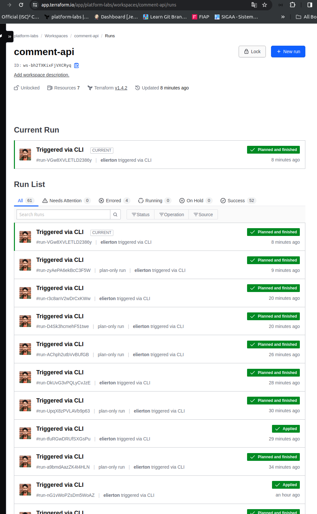

# Histórico de Versões

## Versão 1.0.0 (09 de abril de 2024)

- Implementação de uma arquitetura baseada em EC2, utilizando módulos da comunidade para otimização e padronização.

Referência: https://registry.terraform.io/modules/terraform-aws-modules/ec2-instance/aws/latest

- Utilização do `templatefile` para automatizar a atualização do arquivo `compose`, garantindo a consistência da aplicação.

- Integração com o Docker Hub como repositório de imagens para facilitar o armazenamento e distribuição dos artefatos.


- Implementação de uma esteira de Integração Contínua (CI) e Entrega Contínua (CD) utilizando GitHub Actions para automatizar o processo de build, teste e deploy da aplicação.

- Utilização do Terraform Cloud como backend do arquivo de estado para gerenciamento e aprovação das alterações na infraestrutura, permitindo a revisão e aprovação das mudanças de forma centralizada e auditável.



- Integração com o CloudWatch Logs para monitoramento e registro dos acessos da aplicação, permitindo uma análise detalhada do comportamento e desempenho do sistema.

Referência: https://docs.docker.com/config/containers/logging/awslogs/

- Adoção de práticas e ferramentas de DevOps para garantir a eficiência, qualidade e segurança do ciclo de vida da aplicação.
- Acompanhamento do plano e aplicação das alterações de infraestrutura através da esteira de CI, com aprovação realizada pelo Terraform Cloud, proporcionando uma gestão controlada e segura do ambiente.


## Versão 2.0.0 (10 de abril de 2024)

- Refatoração da arquitetura para utilizar ECS (Elastic Container Service) com lançamentos públicos e Fargate, visando uma gestão mais simplificada e eficiente dos contêineres.
  
- Utilização de volumes efêmeros para armazenamento temporário dentro dos contêineres, garantindo uma abordagem mais leve e flexível para as necessidades de armazenamento da aplicação.
  
- Adoção do serviço AWS ECS para orquestração dos contêineres, facilitando a implantação, escalabilidade e gerenciamento da aplicação de forma automatizada.
  
- Migração do armazenamento de imagens para o Amazon ECR (Elastic Container Registry), oferecendo um repositório público e altamente escalável para armazenar, gerenciar e compartilhar imagens de contêineres.

  

- Implementação de uma esteira de Integração Contínua (CI) e Entrega Contínua (CD) utilizando GitHub Actions para automatizar o processo de build, teste e deploy da aplicação diretamente do repositório.
  
- Integração com o AWS CloudWatch para monitoramento avançado de logs e métricas da aplicação, permitindo uma visão detalhada do desempenho e comportamento em tempo real.

  Referência: [Documentação AWS CloudWatch](https://docs.aws.amazon.com/AmazonCloudWatch/latest/logs/WhatIsCloudWatchLogs.html)

- Continuidade na prática de DevOps, enfatizando a colaboração entre desenvolvimento e operações para garantir a entrega contínua e aprimorar a qualidade do software.
  
- Acompanhamento e gerenciamento das alterações de infraestrutura através de templates do AWS CloudFormation, proporcionando uma abordagem de infraestrutura como código para garantir consistência e controle.

Com estas melhorias, a aplicação está preparada para operar de forma mais eficiente e escalável, mantendo os padrões de qualidade e segurança.

```sh
├── app
│ ├── compose.yaml
│ ├── image
│ │ ├── Dockerfile
│ │ ├── requirements.txt
│ │ └── src
│ │ └── api.py
│ └── README.md
├── COMMENTS.md
├── dev
│ └── us-east-1
│ ├── ec2
│ │ └── comment-api-server
│ │ ├── examples
│ │ │ └── ec2
│ │ │ ├── provider.tf
│ │ │ └── test.tfvars
│ │ ├── template
│ │ │ └── api_server.tpl
│ │ ├── terragrunt.hcl
│ │ └── tests
│ │ └── terraform_test.go
│ ├── ecr
│ │ ├── private-comments-api-registry
│ │ │ └── terragrunt.hcl
│ │ └── public-comments-api-registry
│ │ └── terragrunt.hcl
│ └── ecs
│ └── gunicorn-api
│ └── terragrunt.hcl
├── HISTORY.md
├── images
│ ├── dockerhub.png
│ └── terraformcloud.png
├── README.md
└── terragrunt.hcl

```