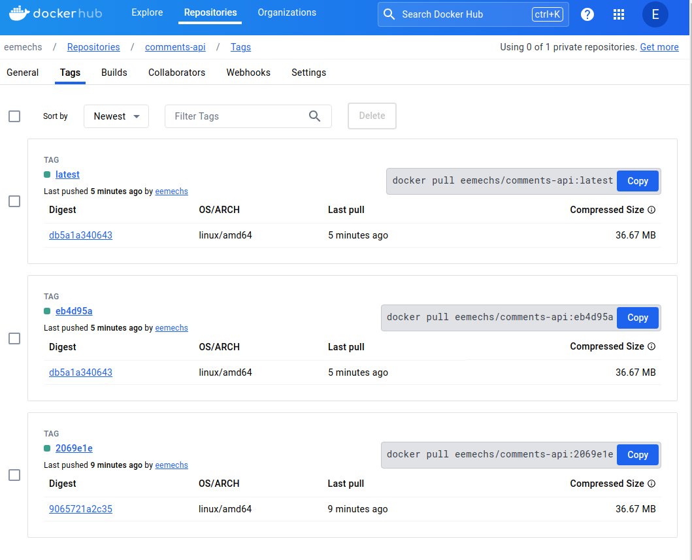

# Histórico de Versões

## Versão 1.0.0 (10 de abril de 2024)

- Implementação de uma arquitetura baseada em EC2, utilizando módulos da comunidade para otimização e padronização.
Referência: https://registry.terraform.io/modules/terraform-aws-modules/ec2-instance/aws/latest

- Utilização do `templatefile` para automatizar a atualização do arquivo `compose`, garantindo a consistência da aplicação.

- Integração com o Docker Hub como repositório de imagens para facilitar o armazenamento e distribuição dos artefatos.

- Implementação de uma esteira de Integração Contínua (CI) e Entrega Contínua (CD) utilizando GitHub Actions para automatizar o processo de build, teste e deploy da aplicação.

- Utilização do Terraform Cloud para gerenciamento e aprovação das alterações na infraestrutura, permitindo a revisão e aprovação das mudanças de forma centralizada e auditável.
- Integração com o CloudWatch Logs para monitoramento e registro dos acessos da aplicação, permitindo uma análise detalhada do comportamento e desempenho do sistema.
Referência: https://docs.docker.com/config/containers/logging/awslogs/

- Adoção de práticas e ferramentas de DevOps para garantir a eficiência, qualidade e segurança do ciclo de vida da aplicação.
- Acompanhamento do plano e aplicação das alterações de infraestrutura através da esteira de CI, com aprovação realizada pelo Terraform Cloud, proporcionando uma gestão controlada e segura do ambiente.

